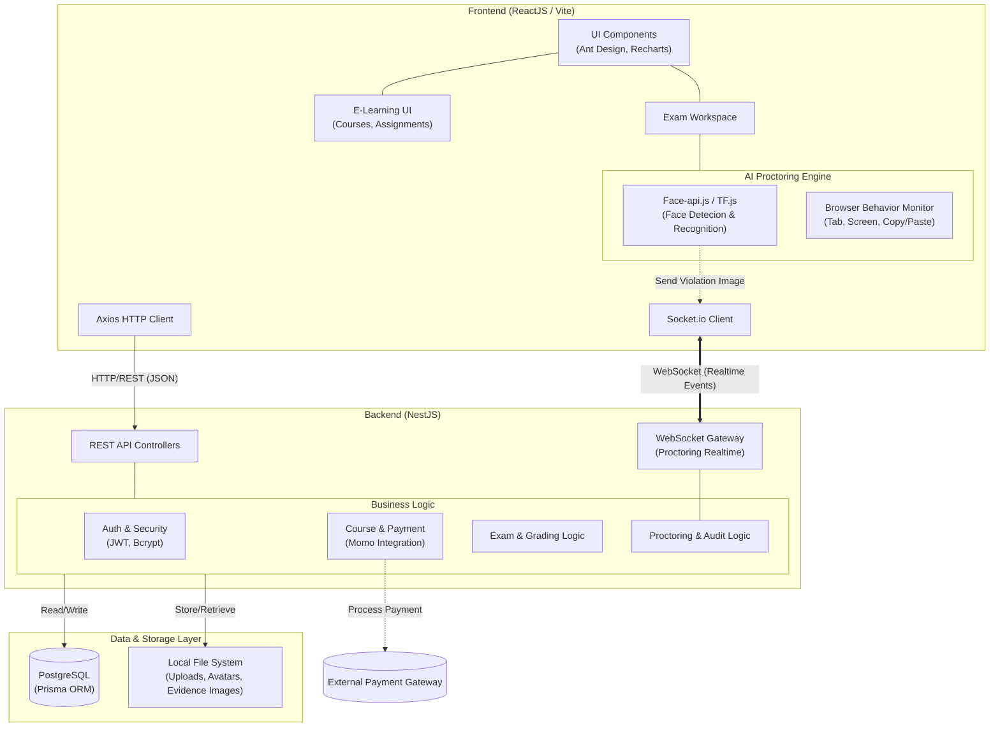

# 🎓 EduExam LMS - Nền tảng Học tập & Thi cử Thông minh tích hợp AI

EduExam là một Hệ thống Quản lý Học tập (LMS) toàn diện, không chỉ cung cấp nền tảng để giảng dạy, kinh doanh khóa học và làm bài tập, mà còn được trang bị hệ thống Giám sát thi cử ứng dụng Trí tuệ Nhân tạo (AI Proctoring) tiên tiến nhằm đảm bảo tính công bằng và minh bạch trong giáo dục trực tuyến.

---

## 🌟 Các tính năng nổi bật (Key Features)

### 📚 1. E-Learning & Kinh doanh Khóa học (Course Marketplace)
- **Kinh doanh Khóa học:** Giảng viên có thể tạo và định giá các lớp học/khóa học. Hệ thống tích hợp thanh toán (MOMO) để sinh viên mua khóa học.
- **Quản lý Học liệu:** Tổ chức bài giảng theo từng chương (Sections) với đa dạng học liệu: File tài liệu (PDF, Word), Video, Đường dẫn (URL).
- **Hệ thống Đánh giá:** Sinh viên có thể để lại Đánh giá (Review) và Rating cho khóa học.

### 📝 2. Quản lý Bài tập & Đánh giá (Assignments)
- **Giao bài tập:** Giảng viên tạo các bài tập về nhà (Assignment) kèm thời hạn nộp bài (Deadline).
- **Nộp & Chấm bài:** Sinh viên nộp bài dưới dạng File đính kèm. Giảng viên có thể tải về, chấm điểm và để lại nhận xét (Feedback) trực tiếp trên hệ thống.

### 🤖 3. Thi trực tuyến & Giám sát AI (AI-Proctored Exams)
- **Ngân hàng câu hỏi:** Quản lý câu hỏi theo môn học, hỗ trợ Trắc nghiệm (Multiple Choice) và Tự luận (Essay). Hỗ trợ sinh đề thi ngẫu nhiên dựa trên luật (Generation Rules).
- **Nhận diện khuôn mặt (Face Verification):** Xác thực danh tính sinh viên trước khi vào phòng thi bằng AI.
- **Giám sát hành vi (Proctoring):** 
  - AI phân tích hình ảnh từ Webcam liên tục để phát hiện: Gian lận khuôn mặt (Nhiều người, Sai người, Không thấy mặt), Hành vi đáng ngờ (Nhìn chỗ khác, Dùng điện thoại).
  - Bắt các thao tác trình duyệt: Rời màn hình, Chuyển Tab, Thoát toàn màn hình, Thao tác Copy/Paste.
- **Chấm điểm tự động:** Hệ thống tự động chấm điểm các câu hỏi trắc nghiệm ngay khi nộp bài.

### 👨‍💼 4. Bảng điều khiển Quản trị (Admin & Teacher Dashboards)
- **Live Feed Giám sát:** Admin có thể xem trực tiếp danh sách vi phạm thời gian thực từ tất cả các phòng thi đang diễn ra.
- **Quản lý Tổng thể:** Quản lý danh sách Người dùng (Phân quyền Role-based), Môn học, và Các kỳ thi.
- **Cài đặt Hệ thống:** Quản lý độ nhạy của AI, cấu hình bảo mật, quy định mật khẩu một cách linh hoạt.

---

## 🏗️ Kiến trúc Hệ thống (System Architecture)

Hệ thống được thiết kế theo kiến trúc Client-Server hiện đại, chia tách rõ ràng các service và xử lý Realtime mạnh mẽ.



---
## 🛠 Công nghệ sử dụng (Tech Stack)

### 1. Phân hệ Ứng dụng & Nền tảng (Application Layer)
| Thành phần | Công nghệ chính | Chức năng |
| :--- | :--- | :--- |
| **Frontend** | ReactJS 19 (Vite), TypeScript | Framework xây dựng giao diện người dùng (UI) |
| | Ant Design (v6) | UI Component Library chuyên nghiệp, responsive |
| | Socket.io-client | Giao tiếp thời gian thực (Real-time communication) |
| | Recharts | Trực quan hóa dữ liệu, vẽ biểu đồ thống kê cho Dashboard |
| **Backend** | NestJS, TypeScript | Framework backend kiến trúc module hóa vững chắc |
| | Prisma ORM | Tương tác cơ sở dữ liệu an toàn, linh hoạt, type-safe |
| | Socket.io | Quản lý kết nối WebSocket, phát luồng (broadcast) cảnh báo |
| | Passport, JWT, Bcrypt | Mã hóa mật khẩu, xác thực (Authentication) và phân quyền (Authorization) |

### 2. Phân hệ Giám sát thông minh (AI Proctoring Layer - Client-side)
*Tất cả mô hình AI được tối ưu hóa để chạy trực tiếp trên trình duyệt (Browser), giảm thiểu độ trễ và tiết kiệm tài nguyên Server.*

| Công nghệ | Kỹ thuật / Mô hình | Nhiệm vụ giám sát (Proctoring Tasks) |
| :--- | :--- | :--- |
| **Face-api.js** | Face Embedding | Trích xuất vector đặc trưng, **nhận diện danh tính (Identity Verification)**, đối soát với ảnh gốc đã đăng ký để chống thi hộ. |
| **MediaPipe** | Face Detection | Định vị khuôn mặt, phát hiện **nhiều người cùng lúc (Multiple Face Detection)** hoặc **vắng mặt (Absence Detection)**. |
| **MediaPipe** | FaceMesh (468 Landmarks) | Theo dõi **cử động đầu (Head Pose Estimation)** (góc Yaw, Pitch) để phát hiện hành vi quay ngang/dọc, không nhìn vào màn hình. |
| **YOLOv8** | Object Detection | Quét và phát hiện các **thiết bị gian lận (Phone/Tablet Detection)** xuất hiện trong khung hình. |
| **OpenCV.js** | Optical Flow | Phân tích biến thiên chuyển động giữa các khung hình, **chống giả mạo (Anti-Spoofing)** bằng ảnh tĩnh hoặc video giả. |

### 3. Phân hệ Dữ liệu & Lưu trữ (Data & Storage Layer)
| Thành phần | Công nghệ chính | Chức năng |
| :--- | :--- | :--- |
| **Database** | PostgreSQL | Cơ sở dữ liệu quan hệ mạnh mẽ, lưu trữ toàn bộ dữ liệu hệ thống (User, Course, Exam, Logs...). |
| **Lưu trữ** | File System (DiskStorage) | Lưu trữ file vật lý: Avatar người dùng, Học liệu đính kèm, và hình ảnh bằng chứng vi phạm lúc thi. |
---

## 🚀 Hướng dẫn Cài đặt & Khởi chạy (Getting Started)

### 1. Yêu cầu Hệ thống (Prerequisites)
- [Node.js](https://nodejs.org/) (Phiên bản 18.x trở lên)
- [PostgreSQL](https://www.postgresql.org/) (Phiên bản 14.x trở lên)
- Git

### 2. Cấu hình Backend
```bash
# Di chuyển vào thư mục backend
cd backend

# Cài đặt các gói phụ thuộc
npm install

# Khởi tạo cơ sở dữ liệu bằng Prisma
npx prisma generate
npx prisma db push

# Chạy server ở chế độ Development
npm run start:dev
```
*(Lưu ý: Bạn cần tạo file `.env` ở thư mục `backend` chứa `DATABASE_URL` và `JWT_SECRET`)*

### 3. Cấu hình Frontend
```bash
# Mở một Terminal mới, di chuyển vào thư mục frontend
cd frontend

# Cài đặt các gói phụ thuộc
npm install

# Khởi chạy ứng dụng
npm run dev
```

Ứng dụng Frontend sẽ chạy tại: `http://localhost:5173`
API Backend sẽ chạy tại: `http://localhost:3000`

### 4. Triển khai bằng Docker (Tùy chọn)
Hệ thống đã được cấu hình sẵn Docker để đóng gói toàn bộ dịch vụ.
```bash
# Khởi chạy toàn bộ hệ thống (DB, Backend, Frontend)
docker-compose up --build
```
*(Lưu ý: Đảm bảo bạn đã cài đặt Docker Desktop trước khi chạy lệnh này)*


---

