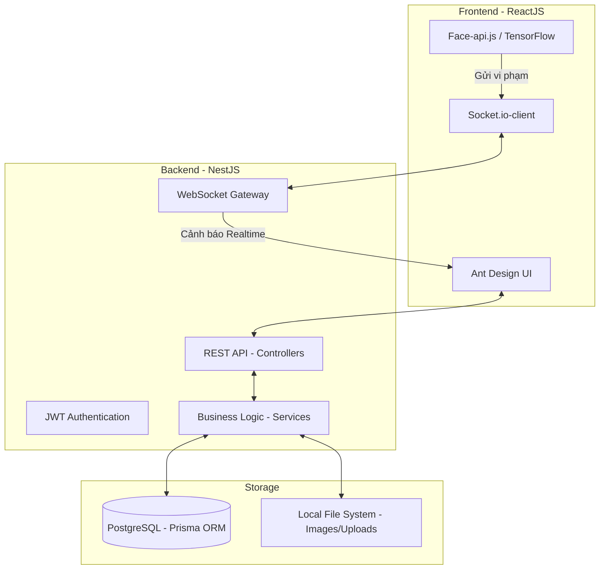

# 🎓 AI Proctoring Exam System

Hệ thống quản lý và giám sát thi trực tuyến ứng dụng trí tuệ nhân tạo (AI) để phát hiện gian lận và xác thực danh tính thí sinh.

## 🌟 Tính năng chính

### 👨‍💼 Quản trị viên (Admin)
- **Dashboard thông minh:** Thống kê tổng quan về người dùng, môn học và tình hình vi phạm toàn hệ thống.
- **Giám sát thời gian thực (Real-time Proctoring):** Theo dõi bảng tin vi phạm trực tiếp (Live Feed) với ảnh bằng chứng từ webcam của thí sinh.
- **Quản lý học thuật:** Quản lý danh sách môn học, người dùng (Giảng viên/Sinh viên).
- **Cấu hình hệ thống:** Tùy chỉnh độ nhạy của AI, quy định mật khẩu và các thông số giám sát.

### 👨‍🏫 Giảng viên (Teacher)
- **Quản lý kỳ thi:** Tạo đề thi, thiết lập thời gian, quy định giám sát (Bật/tắt Camera, Chặn chuyển tab).
- **Ngân hàng câu hỏi:** Quản lý câu hỏi theo môn học và mức độ khó.
- **Chấm điểm:** Tự động chấm điểm trắc nghiệm và hỗ trợ chấm điểm tự luận.

### 👨‍🎓 Sinh viên (Student)
- **Vào phòng thi:** Xác thực khuôn mặt trước khi vào thi.
- **Làm bài thi:** Giao diện thi chuyên nghiệp, tích hợp giám sát AI (Phát hiện chuyển tab, rời màn hình, nhiều người trong khung hình).
- **Xem kết quả:** Xem lại bài thi và các lỗi vi phạm đã mắc phải.

## 🏗️ Kiến trúc hệ thống (System Architecture)



## 🛠️ Công nghệ sử dụng (Tech Stack)

| Thành phần | Công nghệ |
|---|---|
| **Frontend** | React (Vite), Ant Design, Recharts, Socket.io-client, Axios |
| **Backend** | NestJS, Socket.io (WebSocket), Passport JWT, Multer |
| **Database** | PostgreSQL, Prisma ORM |
| **AI Library** | Face-api.js (Phát hiện khuôn mặt, xác thực danh tính trực tiếp trên trình duyệt) |
| **Dev Tools** | TypeScript, ESLint, Prettier |

## 🚀 Hướng dẫn cài đặt

### 1. Yêu cầu hệ thống
- Node.js (v18+)
- PostgreSQL

### 2. Cài đặt Backend
```bash
cd backend
npm install
# Tạo file .env và cấu hình DATABASE_URL, JWT_SECRET
npx prisma generate
npm run start:dev
```

### 3. Cài đặt Frontend
```bash
cd frontend
npm install
npm run dev
```

## 🔒 Bảo mật & Giám sát
Hệ thống tích hợp các cơ chế bảo mật:
- Xác thực JWT cho mọi yêu cầu API.
- Phân quyền (RBAC) Admin - Teacher - Student.
- Giám sát AI phát hiện: Chuyển Tab, Thoát toàn màn hình, Nhiều người, Sai người thi.

---
© 2026 EduExam LMS - Toàn quyền bảo lưu.
