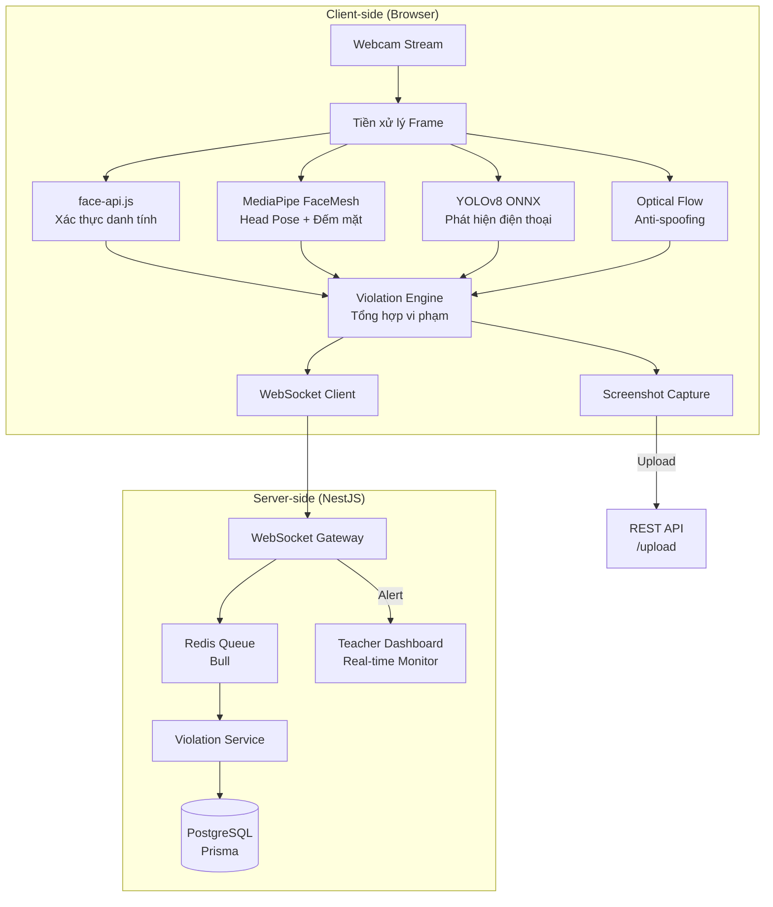

# 🛡️ Kế Hoạch Triển Khai Hệ Thống AI Giám Sát Khuôn Mặt Chống Gian Lận

## 📐 Kiến Trúc Tổng Quan



## 📊 Luồng Hoạt Động 8 Bước

### Bước 1: Thu thập dữ liệu từ Webcam
- Khi sinh viên vào phòng thi (`/exam-room/:examId`), nếu `requireCamera = true`:
  - Hiện giao diện **chụp ảnh đại diện xác thực** (reference photo) trước khi bắt đầu
  - Yêu cầu quyền truy cập webcam (`navigator.mediaDevices.getUserMedia`)
  - Luồng video được đưa vào `<video>` element ẩn, trích frame mỗi **1 giây**

### Bước 2: Tiền xử lý dữ liệu hình ảnh
- Canvas API chuyển video frame → ImageData
- Resize xuống **320×240** để tăng tốc xử lý
- Chuẩn hóa tỷ lệ khung hình cho từng thư viện AI

### Bước 3: Nhận diện khuôn mặt & Xác thực danh tính (face-api.js)
- Load model: `tinyFaceDetector` + `faceLandmark68Net` + `faceRecognitionNet`
- So sánh vector khuôn mặt hiện tại vs ảnh đại diện ban đầu
- Ngưỡng `euclideanDistance < 0.6` → khớp danh tính
- Nếu không khớp → `DIFFERENT_PERSON` violation

### Bước 4: Giám sát hành vi khuôn mặt (MediaPipe)
- **Face Detection**: Đếm số khuôn mặt → nếu > 1 → `MULTIPLE_FACES`
- **FaceMesh (468 điểm)**: Tính góc yaw/pitch từ 6 điểm (mũi, mắt, cằm)
  - `|yaw| > 30°` kéo dài > 3 giây → `LOOKING_AWAY`
- **Face Absence**: Không phát hiện mặt > 5 giây → `NO_FACE`

### Bước 5: Phát hiện đối tượng gian lận (YOLOv8)
- Load model YOLOv8n (nano) dạng ONNX chạy trên ONNX Runtime Web
- Quét frame mỗi **3 giây** (nặng hơn nên tần suất thấp hơn)
- Phát hiện class: `cell phone`, `tablet`, `book`
- Ngưỡng confidence > 0.5 → `PHONE_DETECTED`

### Bước 6: Anti-spoofing (Optical Flow)
- So sánh 2 frame liên tiếp bằng thuật toán Lucas-Kanade (JS thuần)
- Tính magnitude trung bình của vector chuyển động
- Nếu magnitude < ngưỡng trong > 10 giây liên tục → `STATIC_IMAGE` (ảnh giả)

### Bước 7: Gửi dữ liệu & xử lý tại máy chủ
- **WebSocket** (`@nestjs/websockets` + `socket.io`):
  - Client emit: `violation:report` → `{ sessionId, type, timestamp, screenshotUrl, metadata }`
  - Server broadcast to teacher room: `violation:alert`
- **Redis + Bull Queue**: Xử lý bất đồng bộ khi có nhiều sinh viên đồng thời
- Lưu vào bảng `ViolationLog` trong PostgreSQL

### Bước 8: Cảnh báo & Ghi nhận kết quả
- Teacher nhận real-time notification qua WebSocket
- Dashboard hiển thị danh sách vi phạm theo thời gian thực
- Sau kỳ thi: Báo cáo thống kê vi phạm cho từng sinh viên

---

## 🗄️ Thay Đổi Database Schema

```prisma
// Thêm vào ViolationType enum
enum ViolationType {
  TAB_SWITCH
  MULTIPLE_FACES
  NO_FACE
  DIFFERENT_PERSON
  LOOKING_AWAY
  TAB_SWITCHED
  FULLSCREEN_EXITED
  COPY_PASTE
  PHONE_DETECTED     // MỚI
  STATIC_IMAGE       // MỚI  
}

// Thêm trường vào ExamSession
model ExamSession {
  // ... existing fields ...
  referencePhoto  String?   @map("reference_photo") @db.Text  // URL ảnh xác thực
  proctorEnabled  Boolean   @default(false) @map("proctor_enabled")
}
```

---

## 📦 Packages Cần Cài Đặt

### Frontend
```bash
npm install @mediapipe/face_detection @mediapipe/face_mesh onnxruntime-web socket.io-client
```
> `face-api.js` đã có sẵn trong package.json

### Backend
```bash
npm install @nestjs/websockets @nestjs/platform-socket.io socket.io ioredis bull @nestjs/bull
```

---

## 🗂️ Cấu Trúc File Mới

```
frontend/src/
├── proctoring/
│   ├── ProctoringEngine.ts          # Engine chính điều phối tất cả AI modules
│   ├── FaceVerification.ts          # face-api.js - Xác thực danh tính  
│   ├── FaceBehaviorMonitor.ts       # MediaPipe - Head pose, đếm mặt, absence
│   ├── ObjectDetector.ts            # YOLOv8 ONNX - Phát hiện điện thoại
│   ├── OpticalFlowAnalyzer.ts       # Anti-spoofing bằng optical flow
│   ├── WebSocketClient.ts           # Kết nối WebSocket tới server
│   └── types.ts                     # TypeScript types
├── pages/StudentExamRoom/
│   ├── StudentExamRoom.tsx          # SỬA: Tích hợp ProctoringEngine
│   ├── ReferencePhotoCapture.tsx    # MỚI: Giao diện chụp ảnh xác thực
│   └── ProctoringOverlay.tsx        # MỚI: UI hiển thị webcam + cảnh báo
│   
backend/src/
├── proctoring/
│   ├── proctoring.module.ts         # NestJS Module
│   ├── proctoring.gateway.ts        # WebSocket Gateway
│   ├── proctoring.service.ts        # Business logic xử lý vi phạm
│   └── proctoring.processor.ts      # Bull Queue processor
```

---

## ⚡ Phân Pha Triển Khai

### Phase 1: Hạ tầng cơ bản (WebSocket + Redis + Schema)
1. Cập nhật Prisma schema (thêm `PHONE_DETECTED`, `STATIC_IMAGE`, `referencePhoto`)
2. Tạo `ProctoringModule` với WebSocket Gateway
3. Cài đặt Redis + Bull Queue
4. API endpoint upload ảnh xác thực

### Phase 2: Giao diện chụp ảnh xác thực + Webcam overlay
1. `ReferencePhotoCapture.tsx` - Màn hình chụp ảnh trước khi thi
2. `ProctoringOverlay.tsx` - Hiển thị webcam nhỏ góc màn hình + badge cảnh báo
3. Tích hợp vào `StudentExamRoom.tsx`

### Phase 3: AI Modules phía Client
1. `FaceVerification.ts` - face-api.js xác thực danh tính
2. `FaceBehaviorMonitor.ts` - MediaPipe head pose + face count + absence
3. `ObjectDetector.ts` - YOLOv8 ONNX phát hiện điện thoại
4. `OpticalFlowAnalyzer.ts` - Anti-spoofing

### Phase 4: Engine tổng hợp + Teacher Dashboard ✅ HOÀN THÀNH
1. `ProctoringEngine.ts` - Điều phối tất cả modules ✅
2. Dashboard giảng viên xem vi phạm real-time ✅
   - `TeacherProctoringDashboard.tsx` + CSS
   - Summary cards (tổng SV, tổng vi phạm, SV có vi phạm, SV sạch)
   - Biểu đồ phân bố loại vi phạm (horizontal bar chart)
   - Bảng danh sách SV với bộ lọc (Tất cả / Có vi phạm / Sạch)
   - Modal chi tiết timeline vi phạm từng SV
3. Báo cáo thống kê vi phạm sau kỳ thi ✅
   - `ProctoringController` (REST API): `/proctoring/exam/:examId/stats`, `/summary`, `/session/:id/violations`
   - Tích hợp vào `TeacherActivityDetail.tsx` với nút "Mở Dashboard giám sát vi phạm"

---

## 🔑 Lưu Ý Quan Trọng

| Vấn đề | Giải pháp |
|--------|-----------|
| **YOLOv8 nặng** | Dùng model nano (yolov8n), quét mỗi 3s thay vì mỗi frame |
| **MediaPipe CDN** | Load từ CDN chính thức, cache browser |
| **Redis trên Windows** | Dùng Docker hoặc Memurai (Redis cho Windows) |
| **Models AI lớn** | Đặt trong `public/models/` của frontend, browser cache |
| **Tốn pin laptop** | Cho phép tắt AI proctoring khi giảng viên không yêu cầu |
| **Quyền riêng tư** | Ảnh screenshot chỉ lưu khi có vi phạm, tự xóa sau 30 ngày |

---

> [!IMPORTANT]
> Đây là kế hoạch tổng thể. Do tính năng rất lớn, em đề xuất triển khai **Phase 1 + 2** trước để có nền tảng vững chắc, sau đó tiếp tục Phase 3 + 4. Thầy/cô có muốn điều chỉnh gì trước khi em bắt đầu code không?
